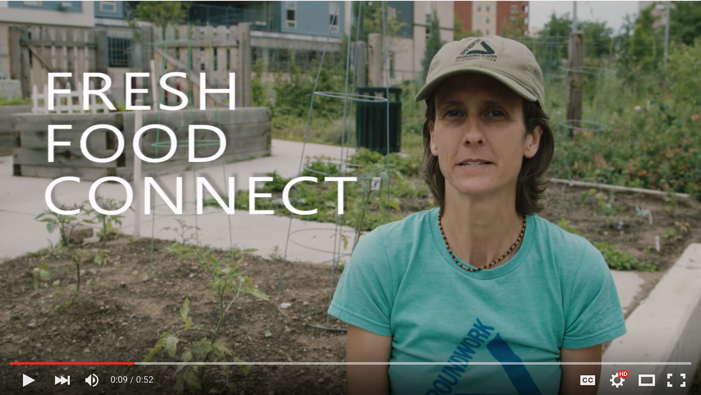

> View this project's Kanban board for tasks here: 

# Fresh Food Connect

This repo contains the client code for Fresh Food Connect. The server code can be found here: https://github.com/codefordenver/ffc-server
